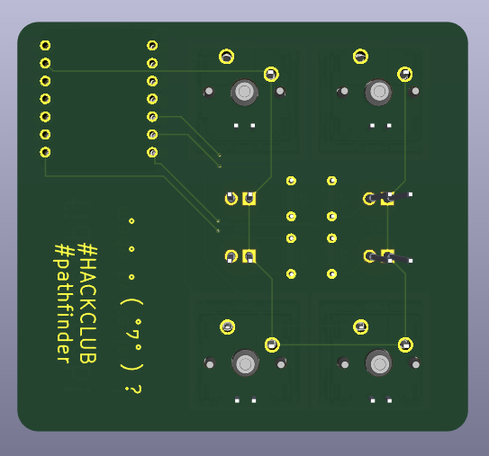

# Fidget PCB!
(Submission for Hack Club: Pathfinder, Highway, Athena Award)

4 key, 4 LED controller board. Pressing one key will turn LEDs on one by one. 
Pressing a different key will cycle through the buttons, turning off the previous LED. 
A third key-LED pair is normal, but the fourth key will only turn on its corresponding LED if pressed quickly after the third.

## Schematic

## PCB View: Front

## PCB View: Back

